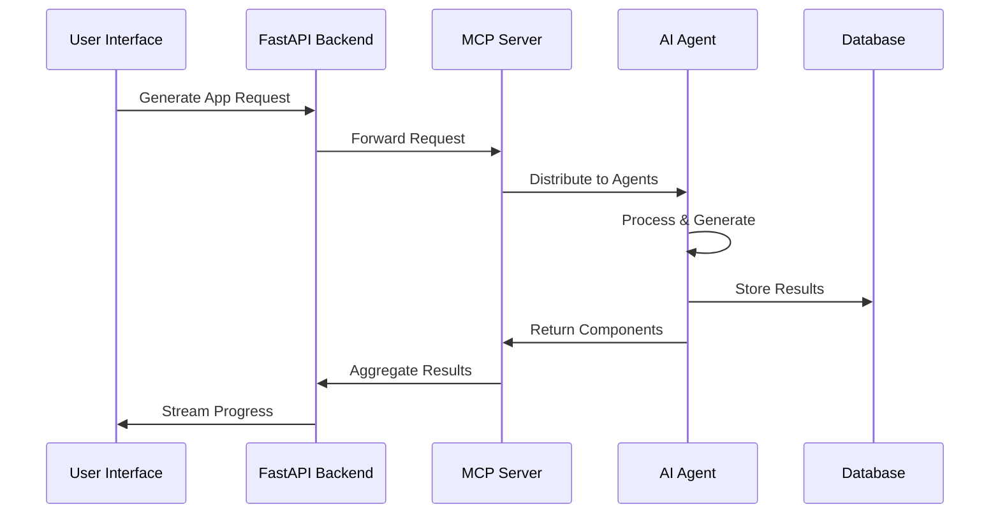

# Autonoma - Modern AI Webapp Creator Architecture

## 🏗️ System Overview

Autonoma is a cutting-edge AI-powered platform that transforms natural language prompts into production-ready full-stack applications. Built with the latest technologies and architectural patterns, it leverages multiple AI agents, MCP servers, and modern web frameworks.

## 🎯 Core Philosophy

- **AI-First**: Every component is designed to work seamlessly with AI agents
- **Modern Stack**: Leverages the latest web technologies and best practices
- **Scalable**: Built for production with enterprise-grade scalability
- **Developer Experience**: Optimized for both end-users and developers
- **Future-Ready**: Designed to adapt to emerging technologies

## 🔧 Technology Stack

### Frontend
- **Next.js 14** with App Router and Server Actions
- **TypeScript** for type safety
- **Tailwind CSS** with custom design system
- **Radix UI** for accessible components
- **Framer Motion** for animations
- **React Query** for data fetching
- **Zustand** for state management
- **Monaco Editor** for code editing
- **Socket.IO** for real-time updates

### Backend
- **FastAPI** with async/await support
- **SQLAlchemy** with async PostgreSQL
- **Alembic** for database migrations
- **Celery** with Redis for background tasks
- **Pydantic v2** for data validation
- **WebSockets** for real-time communication

### AI & ML
- **OpenAI GPT-4** for general code generation
- **Anthropic Claude** for complex reasoning
- **LangChain** for AI workflow orchestration
- **ChromaDB** for vector embeddings
- **Sentence Transformers** for similarity search
- **Tree-sitter** for code parsing

### MCP Architecture
- **Model Context Protocol** servers for AI agent communication
- **WebSocket-based** real-time agent coordination
- **Multi-agent orchestration** with specialized agents
- **Tool calling** and resource sharing

### Infrastructure
- **Docker** with multi-stage builds
- **PostgreSQL 16** with pgvector extension
- **Redis 7** for caching and queues
- **Nginx** for reverse proxy
- **Prometheus** for metrics
- **Grafana** for observability

### Web3 Integration (Optional)
- **Wagmi** for Ethereum interactions
- **Viem** for low-level blockchain operations
- **RainbowKit** for wallet connections
- **Hardhat** for smart contract development

## 🏛️ Architecture Layers

### 1. Presentation Layer (Frontend)
```
┌─────────────────────────────────────────────────────────────┐
│                     Next.js 14 Frontend                     │
├─────────────────────────────────────────────────────────────┤
│  App Router Pages  │  Components  │  Real-time Preview     │
├─────────────────────────────────────────────────────────────┤
│  State Management  │  API Client  │  WebSocket Client      │
└─────────────────────────────────────────────────────────────┘
```

### 2. API Gateway Layer
```
┌─────────────────────────────────────────────────────────────┐
│                    FastAPI Backend                         │
├─────────────────────────────────────────────────────────────┤
│  Authentication   │  Rate Limiting   │  CORS               │
├─────────────────────────────────────────────────────────────┤
│  REST Endpoints   │  GraphQL         │  WebSocket Routes   │
└─────────────────────────────────────────────────────────────┘
```

### 3. Business Logic Layer
```
┌─────────────────────────────────────────────────────────────┐
│                   Service Layer                            │
├─────────────────────────────────────────────────────────────┤
│  AI Orchestrator  │  Code Generator  │  Deployment Mgr     │
├─────────────────────────────────────────────────────────────┤
│  Project Manager  │  User Manager    │  Template Engine    │
└─────────────────────────────────────────────────────────────┘
```

### 4. AI Agent Layer (MCP)
```
┌─────────────────────────────────────────────────────────────┐
│                  MCP Server Network                        │
├─────────────────────────────────────────────────────────────┤
│  Code Agent      │  Design Agent    │  Testing Agent       │
├─────────────────────────────────────────────────────────────┤
│  Security Agent  │  Performance     │  Deployment Agent    │
└─────────────────────────────────────────────────────────────┘
```

### 5. Data Layer
```
┌─────────────────────────────────────────────────────────────┐
│                    Data Storage                            │
├─────────────────────────────────────────────────────────────┤
│  PostgreSQL      │  Redis Cache     │  Vector DB           │
├─────────────────────────────────────────────────────────────┤
│  File Storage    │  Blob Storage    │  Message Queue       │
└─────────────────────────────────────────────────────────────┘
```

## 🤖 AI Agent Architecture

### Multi-Agent System
Our platform uses specialized AI agents that work together to create comprehensive applications:

#### Core Agents
1. **Requirements Analyst Agent**
   - Parses user prompts
   - Extracts functional requirements
   - Suggests optimal tech stacks

2. **Architecture Agent**
   - Designs system architecture
   - Creates project structure
   - Plans component hierarchy

3. **Frontend Agent**
   - Generates React/Next.js components
   - Creates responsive layouts
   - Implements user interactions

4. **Backend Agent**
   - Creates API endpoints
   - Designs database schemas
   - Implements business logic

5. **Testing Agent**
   - Generates unit tests
   - Creates integration tests
   - Implements E2E testing

6. **Security Agent**
   - Implements authentication
   - Adds security measures
   - Performs vulnerability analysis

7. **Performance Agent**
   - Optimizes code performance
   - Implements caching strategies
   - Analyzes bundle sizes

8. **Deployment Agent**
   - Creates deployment configs
   - Sets up CI/CD pipelines
   - Manages infrastructure

### MCP Protocol Flow


## 📊 Data Flow

### 1. User Request Processing
```
User Prompt → Requirements Analysis → Tech Stack Selection → Architecture Planning
```

### 2. Code Generation Pipeline
```
Architecture Plan → Parallel Agent Processing → Code Validation → Integration Testing
```

### 3. Deployment Pipeline
```
Generated Code → Build Process → Testing → Deployment → Live Preview
```

## 🔄 Real-time Features

### WebSocket Communication
- **Live Progress Updates**: Real-time generation progress
- **Code Streaming**: Live code as it's being generated
- **Preview Updates**: Instant preview of generated components
- **Collaborative Editing**: Multiple users can work together

### Server-Sent Events
- **Build Status**: Real-time build and deployment status
- **Error Notifications**: Instant error reporting
- **Performance Metrics**: Live performance monitoring

## 🗄️ Database Schema

### Core Tables
```sql
-- Users and Authentication
users (id, email, name, created_at, updated_at)
user_sessions (id, user_id, token, expires_at)

-- Projects and Generation
projects (id, user_id, name, description, status, config)
generation_requests (id, project_id, prompt, tech_stack, status)
generated_components (id, request_id, type, code, file_path)

-- AI Agent Tracking
agent_sessions (id, request_id, agent_type, status, results)
agent_logs (id, session_id, level, message, timestamp)

-- Templates and Examples
code_templates (id, name, type, framework, code, metadata)
project_templates (id, name, description, config, preview_url)
```

### Vector Storage (ChromaDB)
```python
# Code embeddings for similarity search
collections = [
    "code_templates",    # Pre-built code snippets
    "ui_components",     # UI component library
    "api_patterns",      # Backend API patterns
    "deployment_configs" # Deployment configurations
]
```

## 🔒 Security Architecture

### Authentication & Authorization
- **JWT-based authentication** with refresh tokens
- **Role-based access control** (RBAC)
- **API key management** for external services
- **Rate limiting** and DDoS protection

### Data Security
- **Encryption at rest** for sensitive data
- **TLS/SSL** for all communications
- **Input sanitization** and validation
- **SQL injection prevention**

### AI Security
- **Prompt injection protection**
- **Code execution sandboxing**
- **Output validation** and sanitization
- **API usage monitoring**

## 📈 Scalability & Performance

### Horizontal Scaling
- **Stateless API servers** with load balancing
- **Microservices architecture** with Docker
- **Database read replicas** for scaling reads
- **CDN integration** for static assets

### Caching Strategy
- **Redis caching** for frequently accessed data
- **API response caching** with TTL
- **Browser caching** with proper headers
- **Vector embedding caching**

### Performance Optimization
- **Lazy loading** for large components
- **Code splitting** with Next.js
- **Image optimization** with next/image
- **Bundle optimization** with webpack

## 🚀 Deployment Architecture

### Development Environment
```yaml
Services:
  - Frontend (Next.js): localhost:3000
  - Backend (FastAPI): localhost:8000
  - MCP Server: localhost:8001
  - PostgreSQL: localhost:5432
  - Redis: localhost:6379
  - ChromaDB: localhost:8002
```

### Production Environment
```yaml
Frontend:
  - Vercel/Netlify deployment
  - Global CDN distribution
  - Edge caching

Backend:
  - Containerized with Docker
  - Kubernetes orchestration
  - Auto-scaling enabled

Databases:
  - Managed PostgreSQL (AWS RDS/GCP Cloud SQL)
  - Redis Cluster for high availability
  - Vector DB with replication
```

### CI/CD Pipeline
```yaml
Stages:
  1. Code Quality:
     - ESLint, Prettier
     - Python Black, MyPy
     - Unit tests
  
  2. Security Scanning:
     - Dependency vulnerabilities
     - SAST analysis
     - Docker image scanning
  
  3. Build & Test:
     - Frontend build
     - Backend testing
     - Integration tests
  
  4. Deployment:
     - Staging deployment
     - Production deployment
     - Health checks
```

## 🔮 Future Enhancements

### Planned Features
1. **Multi-modal AI**: Support for image and voice inputs
2. **Custom AI Agents**: User-defined specialized agents
3. **Plugin System**: Third-party integrations
4. **Advanced Analytics**: Usage patterns and optimization
5. **Collaborative Features**: Team workspaces
6. **Mobile App**: React Native companion app

### Technology Roadmap
- **Edge Computing**: Move AI processing closer to users
- **WebAssembly**: Client-side code generation
- **Blockchain Integration**: Decentralized deployment
- **Quantum-Ready**: Preparation for quantum computing

## 📚 Development Guidelines

### Code Standards
- **TypeScript strict mode** for all frontend code
- **Python type hints** for all backend code
- **Comprehensive testing** with >90% coverage
- **Documentation** for all public APIs

### Architecture Principles
- **Separation of Concerns**: Clear layer boundaries
- **Dependency Injection**: Loose coupling between components
- **Event-Driven Architecture**: Asynchronous communication
- **Microservices**: Independent deployable services

### Performance Targets
- **Page Load Time**: < 2 seconds
- **API Response Time**: < 500ms (95th percentile)
- **AI Generation Time**: < 5 minutes for full apps
- **Uptime**: 99.9% availability

This architecture provides a solid foundation for building a modern, scalable, and AI-powered webapp creation platform that can adapt to future technological advances while maintaining excellent performance and user experience.